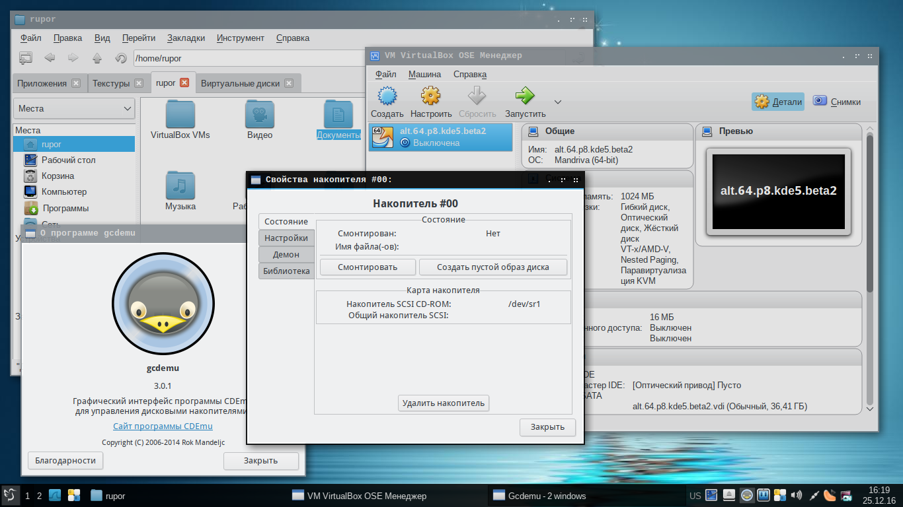

# Themes lxqt-mono

**Source Code:** https://github.com/Koi-foo/themes-lxqt-mono.git

## Summary:
Lxqt Desktop Theme

## Description:
This is the skin for the lxqt desktop. The design is made in contrasting colors (black, blue, gray). The theme was created to convey home comfort and warmth.

## Install

* Unpack the archive into the "mono" directory
* Place the "mono" directory in the system directory /usr/share/lxqt/themes
* Set "mono" theme in lxqt skin settings
* Re-enter the session so that all changes are displayed correctly

## Changelog
* New version v1.1 Release

## Preview

  

